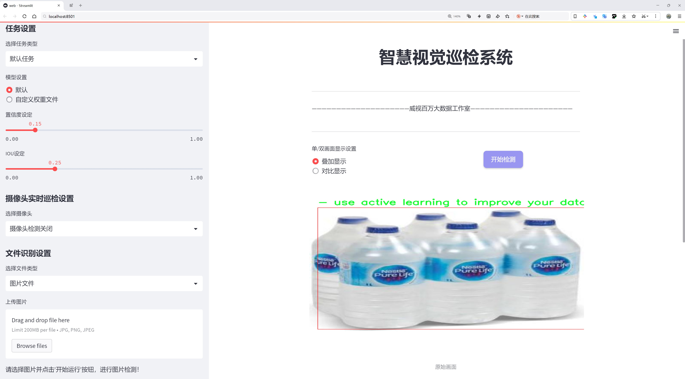
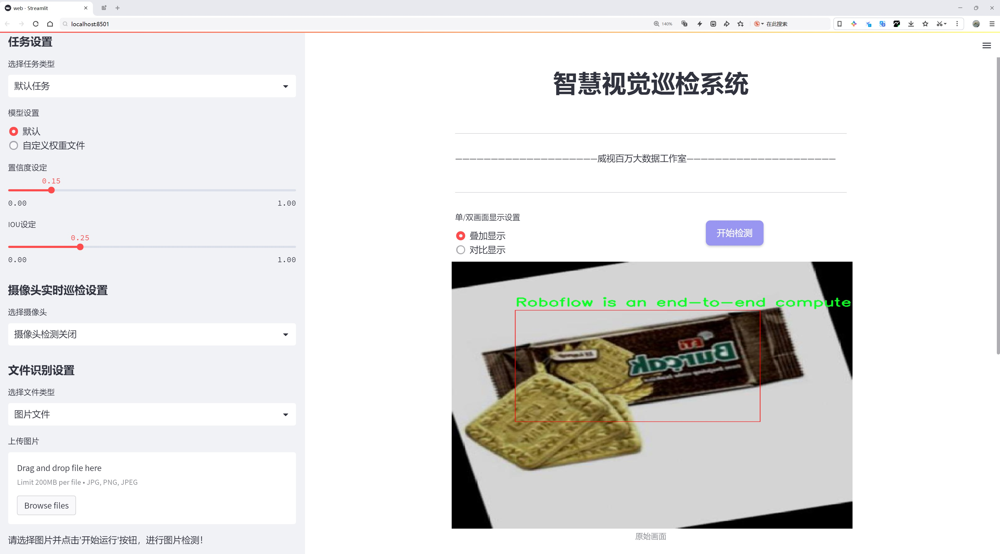
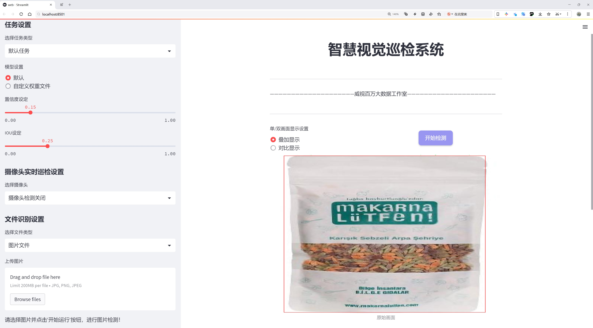
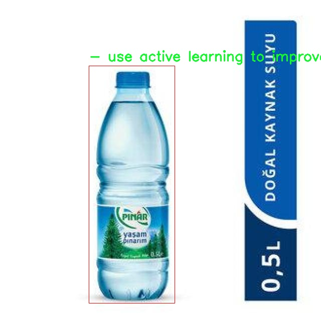
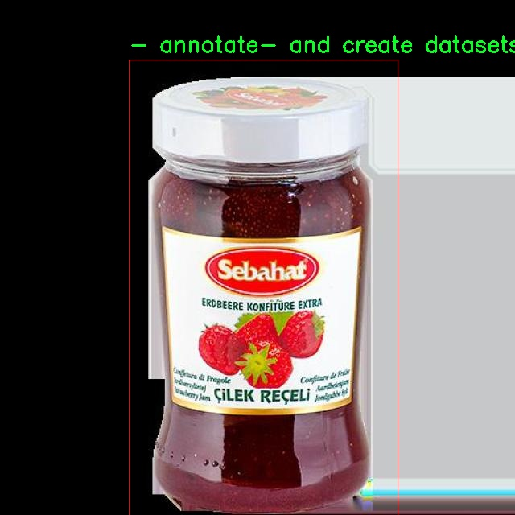
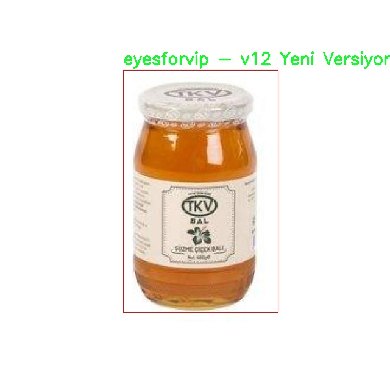
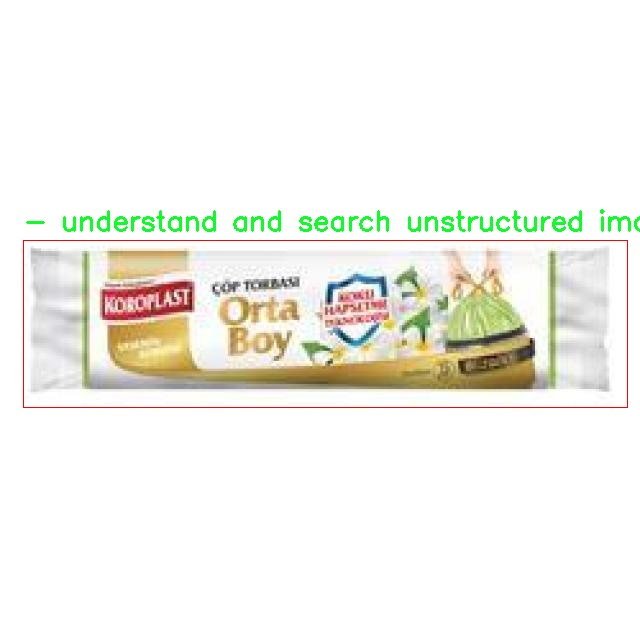
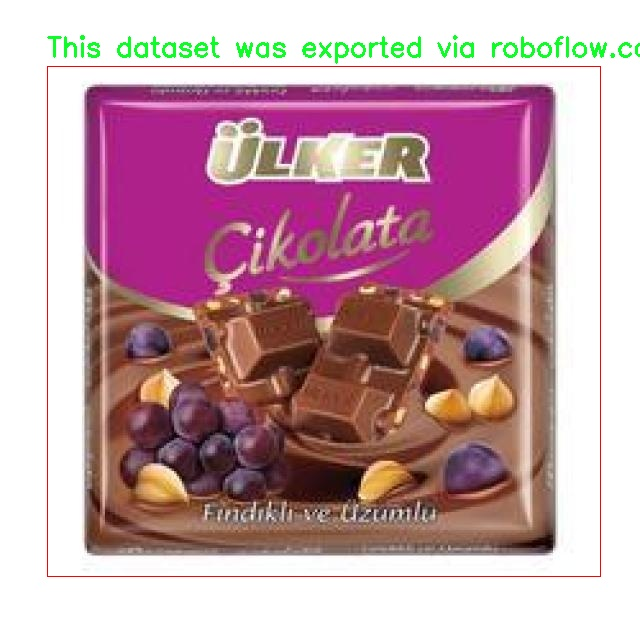

# 货架商品检测检测系统源码分享
 # [一条龙教学YOLOV8标注好的数据集一键训练_70+全套改进创新点发刊_Web前端展示]

### 1.研究背景与意义

项目参考[AAAI Association for the Advancement of Artificial Intelligence](https://gitee.com/qunmasj/projects)

项目来源[AACV Association for the Advancement of Computer Vision](https://github.com/qunshansj/good)

研究背景与意义

随着零售行业的快速发展，货架商品的管理与监控变得愈发重要。传统的货架管理方式依赖人工检查，不仅效率低下，而且容易出现人为错误，导致库存管理不准确、商品缺货或过期等问题。近年来，计算机视觉技术的进步为解决这一问题提供了新的思路。基于深度学习的目标检测算法，尤其是YOLO（You Only Look Once）系列模型，因其高效的实时检测能力和良好的准确性，逐渐成为货架商品检测的主流选择。

YOLOv8作为YOLO系列的最新版本，具备更强的特征提取能力和更快的推理速度，适合在复杂的零售环境中进行商品检测。然而，尽管YOLOv8在多个应用场景中表现出色，但在特定领域如货架商品检测时，仍然面临一些挑战。例如，商品种类繁多、摆放方式多样以及光照条件变化等因素，都可能影响检测的准确性。因此，针对货架商品检测的特定需求，对YOLOv8进行改进和优化显得尤为必要。

本研究旨在基于改进的YOLOv8模型，构建一个高效的货架商品检测系统。为此，我们使用了一个包含3337张图像的数据集，其中包括2222张经过标注的图像。这些图像涵盖了多种商品类别，能够有效支持模型的训练与测试。通过利用Roboflow平台，我们不仅能够高效地管理和组织这些图像数据，还可以利用其提供的主动学习功能，持续改进和扩展数据集，从而提升模型的检测性能。

本研究的意义在于，首先，通过构建一个基于改进YOLOv8的货架商品检测系统，可以显著提高零售商在商品管理方面的效率，减少人工干预，降低运营成本。其次，改进后的模型将为零售行业提供更为精准的商品识别能力，帮助商家实时监控货架状态，及时补货，避免因缺货而导致的销售损失。此外，该系统还可以为消费者提供更好的购物体验，确保他们能够方便地找到所需商品。

最后，本研究不仅具有实际应用价值，还将为计算机视觉领域的研究提供新的思路和方法。通过对YOLOv8的改进，我们希望能够推动目标检测技术在零售行业的进一步应用，探索其在其他领域的潜在价值。总之，基于改进YOLOv8的货架商品检测系统的研究，不仅能够解决当前零售行业面临的实际问题，还将为未来的研究与应用提供重要的参考和借鉴。

### 2.图片演示







##### 注意：由于此博客编辑较早，上面“2.图片演示”和“3.视频演示”展示的系统图片或者视频可能为老版本，新版本在老版本的基础上升级如下：（实际效果以升级的新版本为准）

  （1）适配了YOLOV8的“目标检测”模型和“实例分割”模型，通过加载相应的权重（.pt）文件即可自适应加载模型。

  （2）支持“图片识别”、“视频识别”、“摄像头实时识别”三种识别模式。

  （3）支持“图片识别”、“视频识别”、“摄像头实时识别”三种识别结果保存导出，解决手动导出（容易卡顿出现爆内存）存在的问题，识别完自动保存结果并导出到tempDir中。

  （4）支持Web前端系统中的标题、背景图等自定义修改，后面提供修改教程。

  另外本项目提供训练的数据集和训练教程,暂不提供权重文件（best.pt）,需要您按照教程进行训练后实现图片演示和Web前端界面演示的效果。

### 3.视频演示

[3.1 视频演示](https://www.bilibili.com/video/BV1jvHLeDELZ/?vd_source=ff015de2d29cbe2a9cdbfa7064407a08)

### 4.数据集信息展示

数据集信息展示

在现代计算机视觉领域，数据集的质量和多样性对模型的性能至关重要。本次研究所使用的数据集名为“shelf_Product_”，专门用于训练和改进YOLOv8的货架商品检测系统。该数据集包含了2222张高质量的图像，涵盖了16个不同的类别，旨在帮助研究人员和开发者在实际应用中更好地识别和分类货架上的商品。这些类别的设计不仅考虑了商品的多样性，还兼顾了实际零售环境中的复杂性，确保模型在真实场景中的有效性。

数据集的构建过程注重细节，确保每一张图像都经过精心标注，以便为YOLOv8模型提供丰富的训练样本。这些图像涵盖了各种货架商品的摆放方式、光照条件和背景环境，力求在多样性和代表性上达到最佳平衡。通过这种方式，模型能够学习到不同商品在不同环境下的特征，从而提高其在实际应用中的准确性和鲁棒性。

在数据集的使用过程中，研究人员可以利用先进的计算机视觉技术，进行高效的图像处理和分析。数据集的设计不仅支持基础的商品检测任务，还为更复杂的应用场景提供了基础，例如商品的自动分类、库存管理和销售分析等。通过对这些图像的深入分析，研究人员能够提取出有价值的信息，从而为零售商提供数据驱动的决策支持。

此外，数据集的更新和维护也是其重要特性之一。研究人员可以利用主动学习的方法，不断优化和扩展数据集，确保其在技术进步和市场变化中的适应性。这种灵活性使得“shelf_Product_”数据集不仅是一个静态的资源，而是一个动态发展的工具，能够随着时间的推移而不断增强其价值。

值得一提的是，该数据集的导出时间为2024年7月8日，显示了其最新的状态和相关性。研究人员在使用过程中，可以通过不同的计算机视觉项目进行协作，分享经验和成果，从而推动整个领域的发展。数据集的多样性和高质量标注为YOLOv8模型的训练提供了坚实的基础，使其在实际应用中能够有效应对各种挑战。

总之，“shelf_Product_”数据集为货架商品检测系统的研究和开发提供了重要的支持。通过结合高质量的图像数据和先进的计算机视觉技术，研究人员能够不断提升模型的性能，为零售行业的智能化发展贡献力量。随着技术的不断进步和数据集的持续优化，未来的货架商品检测系统将更加智能和高效，为消费者和商家带来更好的体验。











### 5.全套项目环境部署视频教程（零基础手把手教学）

[5.1 环境部署教程链接（零基础手把手教学）](https://www.ixigua.com/7404473917358506534?logTag=c807d0cbc21c0ef59de5)


[5.2 安装Python虚拟环境创建和依赖库安装视频教程链接（零基础手把手教学）](https://www.ixigua.com/7404474678003106304?logTag=1f1041108cd1f708b01a)

### 6.手把手YOLOV8训练视频教程（零基础小白有手就能学会）

[6.1 环境部署教程链接（零基础手把手教学）](https://www.ixigua.com/7404477157818401292?logTag=d31a2dfd1983c9668658)

### 7.70+种全套YOLOV8创新点代码加载调参视频教程（一键加载写好的改进模型的配置文件）

[7.1 环境部署教程链接（零基础手把手教学）](https://www.ixigua.com/7404478314661806627?logTag=29066f8288e3f4eea3a4)

### 8.70+种全套YOLOV8创新点原理讲解（非科班也可以轻松写刊发刊，V10版本正在科研待更新）

由于篇幅限制，每个创新点的具体原理讲解就不一一展开，具体见下列网址中的创新点对应子项目的技术原理博客网址【Blog】：


[8.1 70+种全套YOLOV8创新点原理讲解链接](https://gitee.com/qunmasj/good)

### 9.系统功能展示（检测对象为举例，实际内容以本项目数据集为准）

图9.1.系统支持检测结果表格显示

  图9.2.系统支持置信度和IOU阈值手动调节

  图9.3.系统支持自定义加载权重文件best.pt(需要你通过步骤5中训练获得)

  图9.4.系统支持摄像头实时识别

  图9.5.系统支持图片识别

  图9.6.系统支持视频识别

  图9.7.系统支持识别结果文件自动保存

  图9.8.系统支持Excel导出检测结果数据


### 10.原始YOLOV8算法原理

原始YOLOv8算法原理

YOLOv8算法是由Ultralytics公司于2023年发布的最新一代YOLO系列目标检测模型，代表了计算机视觉领域中的一项重要进展。作为YOLO系列的基本模型之一，YOLOv8在设计上充分考虑了实时性与精度的平衡，尤其在处理复杂场景和小目标检测方面展现出优越的性能。YOLOv8n是该系列中的一个重要版本，其独特的网络结构和创新的检测方法使其在众多应用场景中表现出色。

YOLOv8的网络结构主要由四个模块组成：输入端、主干网络、颈部网络和输出端。输入端负责对输入图像进行预处理，包括Mosaic数据增强、自适应图像缩放和灰度填充等。这些预处理步骤旨在提高模型对不同输入条件的适应能力，增强数据的多样性，从而提升模型的泛化能力。

在主干网络中，YOLOv8采用了CSP（Cross Stage Partial）结构，将特征提取过程分为两部分，分别进行卷积和连接。与YOLOv5的C3模块相比，YOLOv8引入了C2f模块，这一设计不仅提高了特征提取的效率，还增强了网络的表达能力。C2f模块通过增加跳层连接和Split操作，使得网络能够更好地捕捉到多层次的特征信息。此外，YOLOv8在主干网络的末尾采用了SPPF（Spatial Pyramid Pooling Fast）模块，以提高模型的计算速度和特征融合能力。

颈部网络采用了PAN-FPN（Path Aggregation Network - Feature Pyramid Network）结构，旨在实现多尺度特征的融合。通过上采样和下采样操作，PAN-FPN能够有效地整合来自不同尺度的特征图，从而增强模型对不同大小目标的检测能力。这一设计使得YOLOv8在处理复杂场景时，能够更好地识别和定位目标，尤其是在小目标检测方面，展现出显著的优势。

YOLOv8的输出端采用了解耦头结构，区别于传统的耦合头设计。解耦头将分类和回归过程分开处理，分别进行正负样本匹配和损失计算。这一创新使得模型在进行目标检测时，能够更精确地计算分类损失和回归损失，进而提高检测精度。YOLOv8使用了Task-Aligned Assigner方法，对分类分数和回归分数进行加权，以实现更为精确的样本匹配。

值得注意的是，YOLOv8采用了Anchor-Free检测方式，摒弃了传统的基于锚框的检测方法。这一转变不仅简化了模型的设计，还显著提高了检测精度和速度。通过消除锚框的依赖，YOLOv8能够更灵活地适应不同类型的目标，尤其是在复杂背景下的小目标检测中，表现出更高的准确性。

在损失函数的设计上，YOLOv8引入了CloU（Complete Intersection over Union）损失函数，旨在提高模型的泛化能力和定位精度。CloU损失函数通过综合考虑目标的边界框重叠程度和目标的中心点距离，能够更全面地评估检测结果的准确性。这一设计使得YOLOv8在面对复杂场景时，能够更好地处理定位误差和目标感知能力不足的问题。

尽管YOLOv8在许多方面都取得了显著的进展，但在复杂水面环境下，仍然存在一些挑战。小目标漂浮物的特征复杂且背景多样，导致YOLOv8在这些特定场景下可能出现定位误差和目标感知能力不足的问题。为了解决这些问题，研究者们提出了YOLOv8-WSSOD算法，通过引入BiFormer双层路由注意力机制构建C2fBF模块，旨在保留特征提取过程中更细粒度的上下文信息。此外，针对小目标漏检问题，研究者们还在Neck端引入GSConv和Slim-neck技术，以保持精度并降低计算量。

总的来说，YOLOv8算法通过一系列创新的设计和结构优化，提升了目标检测的精度和速度，尤其在小目标检测和复杂场景下展现出良好的性能。其Anchor-Free检测方式和解耦头结构的引入，使得YOLOv8在实时目标检测领域具有广泛的应用潜力。随着YOLOv8的不断发展和改进，未来在计算机视觉领域的应用将更加广泛，推动着目标检测技术的进一步进步。


### 11.项目核心源码讲解（再也不用担心看不懂代码逻辑）

#### 11.1 ui.py

以下是经过简化和注释的核心代码部分：

```python
import sys
import subprocess
from QtFusion.path import abs_path

def run_script(script_path):
    """
    使用当前 Python 环境运行指定的脚本。

    Args:
        script_path (str): 要运行的脚本路径
    """
    # 获取当前 Python 解释器的路径
    python_path = sys.executable

    # 构建运行命令，使用 streamlit 运行指定的脚本
    command = f'"{python_path}" -m streamlit run "{script_path}"'

    # 执行命令并等待其完成
    result = subprocess.run(command, shell=True)
    
    # 检查命令执行结果，如果返回码不为0，则表示出错
    if result.returncode != 0:
        print("脚本运行出错。")

# 主程序入口
if __name__ == "__main__":
    # 获取要运行的脚本的绝对路径
    script_path = abs_path("web.py")

    # 调用函数运行指定的脚本
    run_script(script_path)
```

### 代码说明：
1. **导入模块**：
   - `sys`：用于获取当前 Python 解释器的路径。
   - `subprocess`：用于执行外部命令。
   - `abs_path`：从 `QtFusion.path` 模块导入，用于获取文件的绝对路径。

2. **`run_script` 函数**：
   - 该函数接收一个脚本路径作为参数，并使用当前 Python 环境运行该脚本。
   - 首先获取当前 Python 解释器的路径，然后构建一个命令字符串，使用 `streamlit` 运行指定的脚本。
   - 使用 `subprocess.run` 执行命令，并检查返回码以判断脚本是否成功运行。

3. **主程序入口**：
   - 在 `if __name__ == "__main__":` 块中，首先获取要运行的脚本的绝对路径，然后调用 `run_script` 函数来执行该脚本。

这个文件是一个名为 `ui.py` 的 Python 脚本，主要功能是运行一个指定的 Python 脚本，具体来说是通过 Streamlit 框架来启动一个 Web 应用。

首先，文件导入了几个必要的模块，包括 `sys`、`os` 和 `subprocess`。其中，`sys` 模块用于访问与 Python 解释器相关的变量和函数，`os` 模块提供了与操作系统交互的功能，而 `subprocess` 模块则用于创建新进程、连接到它们的输入/输出/错误管道，并获取它们的返回码。

接下来，文件从 `QtFusion.path` 模块中导入了 `abs_path` 函数，这个函数的作用是获取给定路径的绝对路径。

在 `run_script` 函数中，首先定义了一个参数 `script_path`，用于接收要运行的脚本的路径。函数内部通过 `sys.executable` 获取当前 Python 解释器的路径，然后构建一个命令字符串，使用 Streamlit 来运行指定的脚本。具体的命令格式是 `"{python_path}" -m streamlit run "{script_path}"`，其中 `python_path` 是当前 Python 解释器的路径，`script_path` 是要运行的脚本的路径。

接着，使用 `subprocess.run` 方法执行构建好的命令。如果命令执行的返回码不为 0，表示脚本运行出错，程序会打印出“脚本运行出错。”的提示信息。

在文件的最后部分，使用 `if __name__ == "__main__":` 语句来确保只有在直接运行该脚本时才会执行以下代码。这里指定了要运行的脚本路径，调用 `abs_path` 函数获取 `web.py` 的绝对路径，然后调用 `run_script` 函数来运行这个脚本。

总体来说，这个 `ui.py` 文件的主要作用是通过 Streamlit 框架来启动一个 Web 应用，提供了一种方便的方式来运行指定的 Python 脚本。

#### 11.2 ultralytics\trackers\basetrack.py

以下是经过简化并注释的核心代码部分：

```python
# Ultralytics YOLO 🚀, AGPL-3.0 license
"""该模块定义了YOLO中对象跟踪的基本类和结构。"""

from collections import OrderedDict
import numpy as np

class TrackState:
    """
    表示被跟踪对象可能状态的枚举类。

    属性：
        New (int): 对象被新检测到的状态。
        Tracked (int): 对象在后续帧中成功跟踪的状态。
        Lost (int): 对象不再被跟踪的状态。
        Removed (int): 对象被移除跟踪的状态。
    """
    New = 0        # 新检测到
    Tracked = 1    # 成功跟踪
    Lost = 2       # 丢失
    Removed = 3    # 移除

class BaseTrack:
    """
    对象跟踪的基类，提供基础属性和方法。

    属性：
        _count (int): 类级别的唯一跟踪ID计数器。
        track_id (int): 跟踪的唯一标识符。
        is_activated (bool): 标志跟踪是否当前激活。
        state (TrackState): 跟踪的当前状态。
        history (OrderedDict): 跟踪状态的有序历史记录。
        features (list): 从对象中提取的用于跟踪的特征列表。
        curr_feature (any): 当前被跟踪对象的特征。
        score (float): 跟踪的置信度分数。
        start_frame (int): 开始跟踪的帧编号。
        frame_id (int): 最近处理的帧ID。
        time_since_update (int): 自上次更新以来经过的帧数。
        location (tuple): 在多摄像头跟踪中的对象位置。

    方法：
        end_frame: 返回对象被跟踪的最后一帧ID。
        next_id: 增加并返回下一个全局跟踪ID。
        activate: 激活跟踪的抽象方法。
        predict: 预测跟踪的下一个状态的抽象方法。
        update: 用新数据更新跟踪的抽象方法。
        mark_lost: 将跟踪标记为丢失。
        mark_removed: 将跟踪标记为移除。
        reset_id: 重置全局跟踪ID计数器。
    """

    _count = 0  # 类级别的ID计数器

    def __init__(self):
        """初始化一个新的跟踪对象，分配唯一ID和基础跟踪属性。"""
        self.track_id = 0  # 跟踪ID
        self.is_activated = False  # 跟踪是否激活
        self.state = TrackState.New  # 初始状态为新检测
        self.history = OrderedDict()  # 跟踪状态历史
        self.features = []  # 特征列表
        self.curr_feature = None  # 当前特征
        self.score = 0  # 置信度分数
        self.start_frame = 0  # 开始帧
        self.frame_id = 0  # 最近帧ID
        self.time_since_update = 0  # 自上次更新以来的帧数
        self.location = (np.inf, np.inf)  # 对象位置

    @property
    def end_frame(self):
        """返回跟踪的最后一帧ID。"""
        return self.frame_id

    @staticmethod
    def next_id():
        """增加并返回全局跟踪ID计数器。"""
        BaseTrack._count += 1
        return BaseTrack._count

    def activate(self, *args):
        """激活跟踪的抽象方法，需在子类中实现。"""
        raise NotImplementedError

    def predict(self):
        """预测跟踪的下一个状态的抽象方法，需在子类中实现。"""
        raise NotImplementedError

    def update(self, *args, **kwargs):
        """用新观察更新跟踪的抽象方法，需在子类中实现。"""
        raise NotImplementedError

    def mark_lost(self):
        """将跟踪标记为丢失。"""
        self.state = TrackState.Lost

    def mark_removed(self):
        """将跟踪标记为移除。"""
        self.state = TrackState.Removed

    @staticmethod
    def reset_id():
        """重置全局跟踪ID计数器。"""
        BaseTrack._count = 0
```

### 代码注释说明：
1. **TrackState 类**：定义了跟踪对象的不同状态，便于管理和更新对象的状态。
2. **BaseTrack 类**：作为所有跟踪对象的基类，包含了跟踪所需的基本属性和方法。
3. **属性**：包括跟踪ID、状态、特征、置信度等，提供了跟踪对象的基本信息。
4. **方法**：提供了激活、预测、更新、标记丢失和移除等操作的接口，确保子类可以实现具体的跟踪逻辑。

这个程序文件是Ultralytics YOLO（一个流行的目标检测框架）中的一个模块，主要定义了用于目标跟踪的基础类和结构。文件中包含了两个主要的类：`TrackState`和`BaseTrack`。

`TrackState`类是一个枚举类，用于表示被跟踪对象的可能状态。它定义了四种状态：`New`表示对象是新检测到的，`Tracked`表示对象在后续帧中成功被跟踪，`Lost`表示对象不再被跟踪，`Removed`表示对象已从跟踪中移除。

`BaseTrack`类是一个基础类，提供了目标跟踪所需的基本属性和方法。它包含一个类级别的计数器`_count`，用于生成唯一的跟踪ID。每个跟踪实例都有自己的唯一标识符`track_id`，一个布尔标志`is_activated`表示跟踪是否处于激活状态，`state`属性表示当前的跟踪状态，`history`是一个有序字典，用于记录跟踪状态的历史，`features`是从对象中提取的特征列表，`curr_feature`是当前被跟踪对象的特征，`score`是跟踪的置信度分数，`start_frame`表示跟踪开始的帧号，`frame_id`是最近处理的帧ID，`time_since_update`表示自上次更新以来经过的帧数，`location`是对象在多摄像头跟踪中的位置。

在方法方面，`BaseTrack`类提供了一些重要的功能。`end_frame`属性返回跟踪的最后一帧ID，`next_id`静态方法用于递增并返回下一个全局跟踪ID。`activate`、`predict`和`update`方法是抽象方法，分别用于激活跟踪、预测下一个状态和更新跟踪，具体实现需要在子类中定义。`mark_lost`和`mark_removed`方法用于将跟踪状态标记为丢失或移除。最后，`reset_id`静态方法用于重置全局跟踪ID计数器。

总体来说，这个模块为YOLO目标检测框架中的目标跟踪提供了基础设施，定义了跟踪对象的状态和属性，并提供了相应的方法以便在实际应用中进行扩展和实现。

#### 11.3 ultralytics\trackers\bot_sort.py

以下是经过简化和注释的核心代码部分，保留了主要的功能和结构：

```python
# 导入必要的库
from collections import deque
import numpy as np
from .basetrack import TrackState
from .byte_tracker import BYTETracker, STrack
from .utils import matching
from .utils.gmc import GMC
from .utils.kalman_filter import KalmanFilterXYWH

class BOTrack(STrack):
    """
    BOTrack类用于YOLOv8的对象跟踪，扩展了STrack类，增加了对象跟踪的功能。
    """

    # 共享的卡尔曼滤波器实例
    shared_kalman = KalmanFilterXYWH()

    def __init__(self, tlwh, score, cls, feat=None, feat_history=50):
        """初始化BOTrack实例，设置特征历史、平滑因子和当前特征。"""
        super().__init__(tlwh, score, cls)  # 调用父类构造函数

        self.smooth_feat = None  # 平滑特征
        self.curr_feat = None  # 当前特征
        if feat is not None:
            self.update_features(feat)  # 更新特征
        self.features = deque([], maxlen=feat_history)  # 存储特征的双端队列
        self.alpha = 0.9  # 平滑因子

    def update_features(self, feat):
        """更新特征向量，并使用指数移动平均进行平滑处理。"""
        feat /= np.linalg.norm(feat)  # 归一化特征
        self.curr_feat = feat  # 更新当前特征
        if self.smooth_feat is None:
            self.smooth_feat = feat  # 如果平滑特征为空，则直接赋值
        else:
            # 使用指数移动平均更新平滑特征
            self.smooth_feat = self.alpha * self.smooth_feat + (1 - self.alpha) * feat
        self.features.append(feat)  # 将特征添加到队列中
        self.smooth_feat /= np.linalg.norm(self.smooth_feat)  # 归一化平滑特征

    def predict(self):
        """使用卡尔曼滤波器预测均值和协方差。"""
        mean_state = self.mean.copy()  # 复制当前均值状态
        if self.state != TrackState.Tracked:
            mean_state[6] = 0  # 如果状态不是跟踪状态，重置速度
            mean_state[7] = 0

        # 预测新的均值和协方差
        self.mean, self.covariance = self.kalman_filter.predict(mean_state, self.covariance)

    @property
    def tlwh(self):
        """获取当前边界框位置，格式为 (左上角x, 左上角y, 宽度, 高度)。"""
        if self.mean is None:
            return self._tlwh.copy()  # 如果均值为空，返回原始边界框
        ret = self.mean[:4].copy()  # 复制均值的前四个元素
        ret[:2] -= ret[2:] / 2  # 计算左上角坐标
        return ret

class BOTSORT(BYTETracker):
    """
    BOTSORT类用于YOLOv8的对象跟踪，设计用于ReID和GMC算法。
    """

    def __init__(self, args, frame_rate=30):
        """初始化BOTSORT实例，设置ReID模块和GMC算法。"""
        super().__init__(args, frame_rate)  # 调用父类构造函数
        self.proximity_thresh = args.proximity_thresh  # 空间接近阈值
        self.appearance_thresh = args.appearance_thresh  # 外观相似性阈值
        self.gmc = GMC(method=args.gmc_method)  # 初始化GMC算法

    def init_track(self, dets, scores, cls, img=None):
        """使用检测、分数和类别初始化跟踪。"""
        if len(dets) == 0:
            return []  # 如果没有检测，返回空列表
        return [BOTrack(xyxy, s, c) for (xyxy, s, c) in zip(dets, scores, cls)]  # 返回BOTrack实例列表

    def get_dists(self, tracks, detections):
        """计算跟踪和检测之间的距离。"""
        dists = matching.iou_distance(tracks, detections)  # 计算IoU距离
        # TODO: 添加ReID距离计算
        return dists  # 返回距离

    def multi_predict(self, tracks):
        """预测和跟踪多个对象。"""
        BOTrack.multi_predict(tracks)  # 调用BOTrack的多重预测方法
```

### 代码注释说明
1. **BOTrack类**：扩展了STrack类，主要用于实现YOLOv8的对象跟踪功能，包含特征更新、预测和状态管理等方法。
2. **BOTSORT类**：扩展了BYTETracker类，主要用于实现带有ReID和GMC算法的对象跟踪，负责初始化跟踪和计算跟踪与检测之间的距离。
3. **特征更新**：使用指数移动平均来平滑特征，以提高跟踪的稳定性。
4. **卡尔曼滤波**：用于预测对象的状态，帮助跟踪对象在视频帧中的位置变化。

该代码的核心功能在于实现对象的跟踪和状态预测，通过使用卡尔曼滤波器和特征更新来增强跟踪的准确性和稳定性。

这个程序文件 `bot_sort.py` 是 Ultralytics YOLOv8 中用于对象跟踪的实现，主要包含两个类：`BOTrack` 和 `BOTSORT`。`BOTrack` 类是对 `STrack` 类的扩展，增加了对象跟踪的功能，而 `BOTSORT` 类则是对 `BYTETracker` 类的扩展，专门设计用于结合 ReID（重识别）和 GMC（全局运动一致性）算法进行对象跟踪。

在 `BOTrack` 类中，定义了一些属性和方法。它使用共享的卡尔曼滤波器 `shared_kalman` 来进行状态预测和更新。类的构造函数初始化了跟踪对象的基本参数，包括边界框位置、置信度、类别和特征向量。特征向量的更新通过 `update_features` 方法实现，该方法使用指数移动平均来平滑特征，并将其存储在一个双端队列中，以便于历史特征的管理。

`predict` 方法利用卡尔曼滤波器预测当前状态的均值和协方差，而 `re_activate` 和 `update` 方法则用于在新的跟踪信息到来时更新对象的状态和特征。`tlwh` 属性提供了当前对象的位置，以 `(左上角 x, 左上角 y, 宽度, 高度)` 的格式返回。`multi_predict` 方法允许对多个对象进行状态预测，`convert_coords` 和 `tlwh_to_xywh` 方法则用于坐标格式的转换。

`BOTSORT` 类则是一个更高层次的跟踪器，负责初始化跟踪、计算跟踪与检测之间的距离以及进行多对象预测。它的构造函数接受参数并初始化相关的阈值和 GMC 实例。`init_track` 方法用于根据检测结果初始化跟踪对象，支持通过 ReID 模块提取特征。`get_dists` 方法计算跟踪对象与检测对象之间的距离，结合了 IoU 和可选的 ReID 嵌入距离。`multi_predict` 方法则调用 `BOTrack` 的多对象预测方法，完成对多个对象的跟踪。

整体而言，这个文件实现了一个基于 YOLOv8 的高效对象跟踪系统，结合了卡尔曼滤波、重识别和全局运动一致性算法，以提高跟踪的准确性和鲁棒性。

#### 11.4 ultralytics\nn\modules\__init__.py

以下是经过简化并添加详细中文注释的核心代码部分：

```python
# 导入必要的模块和类
from .conv import (
    Conv,  # 卷积层
    DWConv,  # 深度卷积层
    ConvTranspose,  # 转置卷积层
    Focus,  # Focus层，用于特征聚合
    GhostConv,  # Ghost卷积层，减少参数量
)
from .head import Detect, Classify, Segment  # 检测、分类和分割头

# 定义可导出的模块
__all__ = (
    "Conv",  # 标准卷积层
    "DWConv",  # 深度卷积层
    "ConvTranspose",  # 转置卷积层
    "Focus",  # 特征聚合层
    "GhostConv",  # Ghost卷积层
    "Detect",  # 检测模块
    "Classify",  # 分类模块
    "Segment",  # 分割模块
)
```

### 代码注释说明：

1. **导入模块**：
   - 从当前包中导入了一些重要的卷积层和头部模块。每个模块都有其特定的功能，帮助构建神经网络的不同部分。

2. **卷积层**：
   - `Conv`：标准卷积层，用于提取特征。
   - `DWConv`：深度卷积层，减少计算量，适用于轻量级模型。
   - `ConvTranspose`：转置卷积层，通常用于上采样操作。
   - `Focus`：特征聚合层，旨在提高特征提取的效率。
   - `GhostConv`：Ghost卷积层，通过生成更多特征图而减少参数量。

3. **头部模块**：
   - `Detect`：用于目标检测的模块，负责输出检测结果。
   - `Classify`：用于图像分类的模块，输出分类标签。
   - `Segment`：用于图像分割的模块，输出分割掩码。

4. **`__all__`**：
   - 该元组定义了从模块中导出的公共接口，确保只有这些类和函数可以被外部访问，帮助用户了解可用的功能。

通过这些核心部分的组合，可以构建出一个功能强大的深度学习模型，适用于各种计算机视觉任务。

这个程序文件是Ultralytics YOLO框架中的一个模块初始化文件，主要用于导入和组织与神经网络相关的各种组件。文件开头的注释部分简要介绍了Ultralytics YOLO的背景信息以及如何使用该模块进行可视化的示例代码。

在示例代码中，首先导入了必要的库，包括Ultralytics的模块、PyTorch库和操作系统库。接着，创建了一个形状为(1, 128, 40, 40)的张量，并实例化了一个卷积层（`Conv`）。然后，使用`torch.onnx.export`将该卷积层导出为ONNX格式，并通过系统命令调用`onnxsim`对其进行简化，最后打开生成的ONNX文件。

接下来的部分是实际的模块导入。文件从不同的子模块中导入了多个类和函数，这些类和函数涵盖了卷积层、注意力机制、变换器、头部模块等。具体来说，导入的内容包括：

- **block模块**：包含了多种网络结构的基本构件，如不同类型的卷积块（C1, C2, C3等）、瓶颈结构（Bottleneck）和其他复杂结构（如DFL、SPP等）。
- **conv模块**：提供了多种卷积层的实现，包括标准卷积、深度可分离卷积、转置卷积等，以及一些注意力机制（如CBAM、通道注意力和空间注意力）。
- **head模块**：定义了用于不同任务的输出层，如目标检测、分类、姿态估计和分割等。
- **transformer模块**：实现了与变换器相关的结构，包括多层感知机（MLP）、变形变换器解码器和各种变换器层。

最后，`__all__`变量定义了该模块公开的接口，列出了所有可以被外部访问的类和函数。这种做法有助于在使用`from ultralytics.nn.modules import *`时，明确哪些内容是可用的，避免不必要的命名冲突。

总体而言，这个文件是Ultralytics YOLO框架中神经网络模块的核心部分，整合了多种网络组件，为构建和训练深度学习模型提供了基础。

#### 11.5 ultralytics\data\__init__.py

以下是代码中最核心的部分，并附上详细的中文注释：

```python
# 导入基础数据集类
from .base import BaseDataset

# 导入构建数据加载器和YOLO数据集的函数
from .build import build_dataloader, build_yolo_dataset, load_inference_source

# 导入不同类型的数据集类
from .dataset import ClassificationDataset, SemanticDataset, YOLODataset

# 定义模块的公开接口，允许用户从该模块导入以下类和函数
__all__ = (
    "BaseDataset",            # 基础数据集类，所有数据集的基类
    "ClassificationDataset",  # 分类数据集类，用于处理分类任务的数据
    "SemanticDataset",        # 语义分割数据集类，用于处理语义分割任务的数据
    "YOLODataset",            # YOLO数据集类，专门用于YOLO目标检测的训练数据
    "build_yolo_dataset",     # 构建YOLO数据集的函数
    "build_dataloader",       # 构建数据加载器的函数，用于批量加载数据
    "load_inference_source",   # 加载推理源的函数，用于获取推理所需的数据
)
```

### 注释说明：
1. **导入模块**：通过`from .base import BaseDataset`等语句，导入了当前包中的其他模块和类，以便在本模块中使用。
2. **公开接口**：`__all__`变量定义了模块的公共接口，只有在使用`from module import *`时，列出的类和函数才会被导入。这是一种控制模块导出内容的方式，确保用户只访问到必要的部分。

这个程序文件是Ultralytics YOLO项目中的一个初始化文件，位于`ultralytics\data`目录下。文件的主要功能是导入和暴露该模块中的一些关键类和函数，以便其他模块可以方便地使用。

首先，文件顶部的注释表明该项目是Ultralytics YOLO，遵循AGPL-3.0许可证。这是一个开源项目，用户可以自由使用和修改，但需要遵循相应的许可证条款。

接下来，文件通过相对导入的方式引入了几个重要的组件。`BaseDataset`类是从`base`模块导入的，可能是所有数据集类的基类，提供了一些通用的功能和接口。`build_dataloader`、`build_yolo_dataset`和`load_inference_source`函数则是从`build`模块导入的，可能用于构建数据加载器、构建YOLO数据集以及加载推理源数据。

此外，文件还导入了三个具体的数据集类：`ClassificationDataset`、`SemanticDataset`和`YOLODataset`，这些类分别用于处理分类任务、语义分割任务和YOLO目标检测任务的数据。

最后，`__all__`变量定义了该模块的公共接口，列出了可以被外部访问的类和函数。这意味着当用户使用`from ultralytics.data import *`时，只会导入这些指定的组件，而不会导入其他未列出的内容。这种做法有助于保持模块的整洁性和可维护性。

总的来说，这个初始化文件的作用是整合和暴露数据处理相关的功能，方便其他模块或用户在使用Ultralytics YOLO时能够快速访问所需的类和函数。

#### 11.6 train.py

以下是代码中最核心的部分，并附上详细的中文注释：

```python
import os
import torch
import yaml
from ultralytics import YOLO  # 导入YOLO模型库
from QtFusion.path import abs_path  # 导入获取绝对路径的函数

# 确定使用的设备，如果有可用的GPU则使用GPU，否则使用CPU
device = "0" if torch.cuda.is_available() else "cpu"

if __name__ == '__main__':  # 确保该模块被直接运行时才执行以下代码
    workers = 1  # 设置数据加载的工作进程数
    batch = 2  # 设置每个批次的大小

    data_name = "data"  # 数据集名称
    # 获取数据集yaml文件的绝对路径
    data_path = abs_path(f'datasets/{data_name}/{data_name}.yaml', path_type='current')  
    unix_style_path = data_path.replace(os.sep, '/')  # 将路径转换为Unix风格

    # 获取数据集所在目录的路径
    directory_path = os.path.dirname(unix_style_path)
    
    # 读取YAML配置文件，保持原有顺序
    with open(data_path, 'r') as file:
        data = yaml.load(file, Loader=yaml.FullLoader)
    
    # 如果YAML文件中包含'path'项，则修改为当前目录路径
    if 'path' in data:
        data['path'] = directory_path
        # 将修改后的数据写回YAML文件
        with open(data_path, 'w') as file:
            yaml.safe_dump(data, file, sort_keys=False)

    # 加载YOLOv8模型的配置文件
    model = YOLO(model='./ultralytics/cfg/models/v8/yolov8s.yaml', task='detect')  
    
    # 开始训练模型
    results2 = model.train(  
        data=data_path,  # 指定训练数据的配置文件路径
        device=device,  # 指定使用的设备
        workers=workers,  # 指定数据加载的工作进程数
        imgsz=640,  # 指定输入图像的大小为640x640
        epochs=100,  # 指定训练的轮数为100
        batch=batch,  # 指定每个批次的大小
        name='train_v8_' + data_name  # 指定训练任务的名称
    )
```

### 代码核心部分说明：
1. **设备选择**：通过`torch.cuda.is_available()`判断是否有可用的GPU，选择相应的设备进行训练。
2. **数据集路径处理**：读取指定数据集的YAML配置文件，并将其中的路径项修改为当前目录路径，确保模型能够正确找到数据集。
3. **模型加载与训练**：加载YOLOv8模型的配置文件，并开始训练，指定训练所需的参数，如数据路径、设备、工作进程数、图像大小、训练轮数和批次大小。

这个程序文件`train.py`的主要功能是使用YOLOv8模型进行目标检测的训练。首先，程序导入了必要的库，包括`os`、`torch`、`yaml`和`ultralytics`中的YOLO模型。根据当前环境是否支持CUDA，程序会选择使用GPU（设备编号为"0"）或CPU进行计算。

在`__main__`模块中，程序首先设置了一些训练参数，包括工作进程数（`workers`）和批次大小（`batch`）。接着，程序定义了数据集的名称为`data`，并构建了数据集配置文件的绝对路径。这个路径是通过调用`abs_path`函数来获取的，并且将系统路径分隔符替换为Unix风格的斜杠。

程序接下来获取了数据集目录的路径，并打开对应的YAML文件以读取数据集的配置。读取后，程序检查YAML文件中是否包含`path`项，如果有，则将其修改为当前目录路径，并将更新后的内容写回到YAML文件中，以确保模型能够正确找到数据集。

随后，程序加载了YOLOv8的预训练模型，模型配置文件位于指定的路径。接下来，程序调用`model.train()`方法开始训练模型，传入了训练所需的参数，包括数据配置文件路径、设备选择、工作进程数、输入图像大小（640x640）、训练的epoch数量（100）以及训练任务的名称。

整体来看，这段代码实现了从数据集准备到模型训练的完整流程，确保了模型能够在指定的环境中进行有效的训练。

### 12.系统整体结构（节选）

### 整体功能和构架概括

Ultralytics YOLO框架是一个用于目标检测和计算机视觉任务的深度学习库。其整体功能包括数据准备、模型训练、目标跟踪和推理等。框架采用模块化设计，允许用户灵活地使用和扩展不同的组件。主要构架包括：

1. **数据处理**：通过`data`模块提供数据集的加载和预处理功能。
2. **模型定义**：通过`nn`模块定义各种神经网络结构，包括卷积层、注意力机制和变换器等。
3. **训练流程**：`train.py`文件负责设置训练参数并启动模型训练。
4. **目标跟踪**：`trackers`模块实现了多种目标跟踪算法，支持实时跟踪和后处理。
5. **用户界面**：`ui.py`提供了一个简单的用户界面，用于启动和运行模型。
6. **回调和监控**：通过`callbacks`模块实现对训练过程的监控和记录，支持与工具如Weights & Biases和MLflow的集成。

### 文件功能整理表

| 文件路径                                       | 功能描述                                                   |
|------------------------------------------------|------------------------------------------------------------|
| `ui.py`                                       | 提供用户界面，通过Streamlit启动指定的Python脚本。         |
| `ultralytics/trackers/basetrack.py`           | 定义目标跟踪的基础类和状态管理，提供跟踪对象的基本属性和方法。 |
| `ultralytics/trackers/bot_sort.py`            | 实现BOTSORT目标跟踪算法，结合ReID和全局运动一致性进行跟踪。  |
| `ultralytics/nn/modules/__init__.py`          | 导入和组织神经网络相关的组件，提供卷积层、注意力机制等。      |
| `ultralytics/data/__init__.py`                | 导入和暴露数据处理相关的类和函数，支持不同类型的数据集。      |
| `train.py`                                    | 设置训练参数并启动YOLO模型的训练过程。                     |
| `ultralytics/utils/callbacks/wb.py`           | 集成Weights & Biases，记录训练过程中的指标和参数。         |
| `ultralytics/models/__init__.py`              | 导入和组织模型相关的组件，支持不同的YOLO模型实现。          |
| `ultralytics/__init__.py`                     | 初始化Ultralytics模块，设置包的公共接口。                   |
| `ultralytics/utils/callbacks/mlflow.py`       | 集成MLflow，记录训练过程中的指标和参数，支持模型管理。      |

这个表格概述了Ultralytics YOLO框架中各个文件的功能，展示了其模块化设计和各个组件之间的协作关系。

注意：由于此博客编辑较早，上面“11.项目核心源码讲解（再也不用担心看不懂代码逻辑）”中部分代码可能会优化升级，仅供参考学习，完整“训练源码”、“Web前端界面”和“70+种创新点源码”以“13.完整训练+Web前端界面+70+种创新点源码、数据集获取”的内容为准。

### 13.完整训练+Web前端界面+70+种创新点源码、数据集获取


https://mbd.pub/o/bread/ZpqXm5Zy